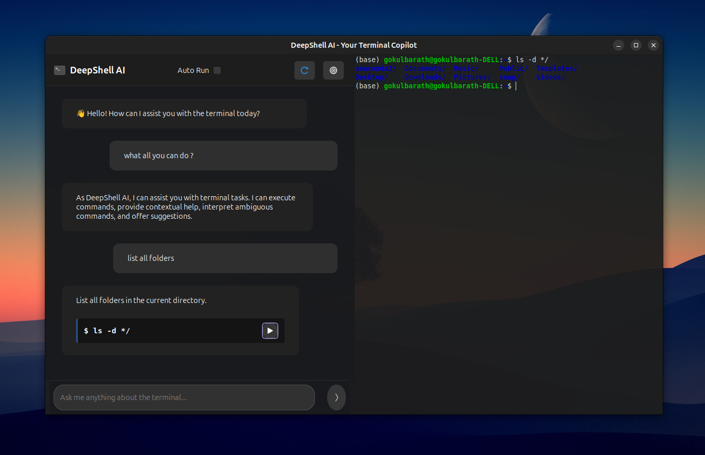

# DeepShell4 - Your Terminal Copilot for Linux Systems

DeepShell4 is an intelligent terminal interface that combines the power of multiple AI models with a modern Linux terminal experience. It serves as your AI-powered copilot, helping you navigate, learn, and master the Linux command line.

[](https://github.com/gokul6350/DeepShell4)
[](https://opensource.org/licenses/MIT)
[](https://build.snapcraft.io/user/gokul6350/DeepShell4)
<a href="https://www.producthunt.com/products/deep-shell?embed=true&utm_source=badge-featured&utm_medium=badge&utm_source=badge-deep&#0045;shell" target="_blank"></a>

## Preview 



*A modern, AI-powered terminal interface with split-screen layout and transparent UI*

## What Can DeepShell4 Do?

🤖 **AI-Powered Terminal Assistance**
- Generate and explain Linux commands
- Debug command errors and provide solutions
- Offer command suggestions and best practices
- Explain complex command outputs
- Help with system administration tasks

🎯 **Multi-Model AI Support**
- Google Gemini: Fast and efficient for general commands
- Groq: High-performance for complex operations
- Easily extendable to support more AI providers
- Smart model switching based on task complexity

💻 **Modern Terminal Features**
- Split-screen interface with AI chat and terminal
- Real-time command execution
- Command history and context awareness
- Transparent, modern GTK-based UI (95% opacity)
- Customizable themes and appearance

🛠️ **Smart Features**
- Auto-run mode for quick command execution
- Command verification before execution
- Context-aware command suggestions
- Integrated error handling and explanations
- Session history preservation

## Requirements

- Python 3.x
- GTK 3.0
- PyGObject
- VTE Terminal
- Internet connection for AI features

## Quick Start

1. Install system dependencies (Ubuntu/Debian):
```bash
sudo apt-get update
sudo apt-get install python3-gi python3-gi-cairo gir1.2-gtk-3.0 gir1.2-vte-2.91
```

2. Set up your API keys:
   - Copy `settings.json.template` to `settings.json`
   - Add your API keys
   ```bash
   cp settings.json.template settings.json
   # Edit settings.json and add your API keys
   ```

   **IMPORTANT: Never commit your API keys to the repository!**

## Installation Options

### Using Snap (Recommended)
The easiest way to install DeepShell4:
```bash
sudo snap install deepshell
```

### Using Debian Package
You can download the latest .deb package from our [GitHub releases](https://github.com/gokul6350/DeepShell4/releases) page or build it yourself:

```bash
# Build the package
dpkg-deb --build deepshell

# Install the package
sudo dpkg -i deepshell.deb
```

### From Source
```bash
# Clone the repository
git clone https://github.com/gokul6350/DeepShell4.git
cd DeepShell4

# Create and activate virtual environment
python3 -m venv venv
source venv/bin/activate

# Install dependencies
pip install -r requirements.txt

# Run the application
python main.py
```

## API Keys Setup

DeepShell4 supports multiple AI providers:
- **Gemini**: Get your API key from [Google AI Studio](https://makersuite.google.com/app/apikey)
- **Groq**: Get your API key from [Groq Cloud](https://console.groq.com/)

Store your API keys securely and never share them or commit them to version control.

## Security Best Practices

1. Always keep your API keys secure
2. Never commit sensitive credentials to Git
3. Use environment variables or secure credential storage
4. Regularly rotate your API keys
5. Monitor your API usage

## Use Cases

- **Learning Linux**: Perfect for beginners learning command-line operations
- **System Administration**: Streamline common admin tasks
- **Development**: Quick command generation for development workflows
- **Troubleshooting**: Get instant help with system issues
- **Task Automation**: Generate and understand shell scripts

## Contributing

Contributions are welcome! Feel free to:
- Report bugs through [GitHub Issues](https://github.com/gokul6350/DeepShell4/issues)
- Suggest new features
- Submit pull requests
- Improve documentation

## License

MIT License - Feel free to use and modify as needed. 
